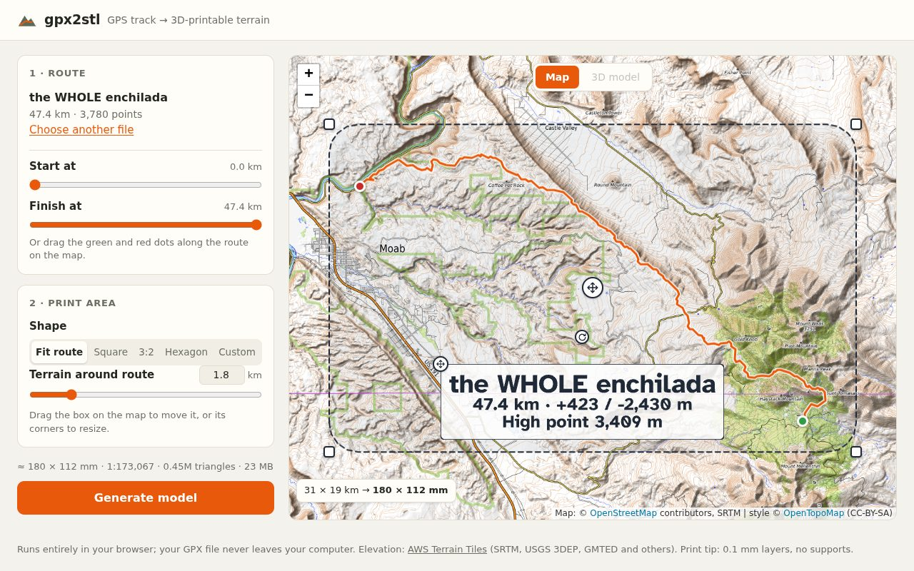
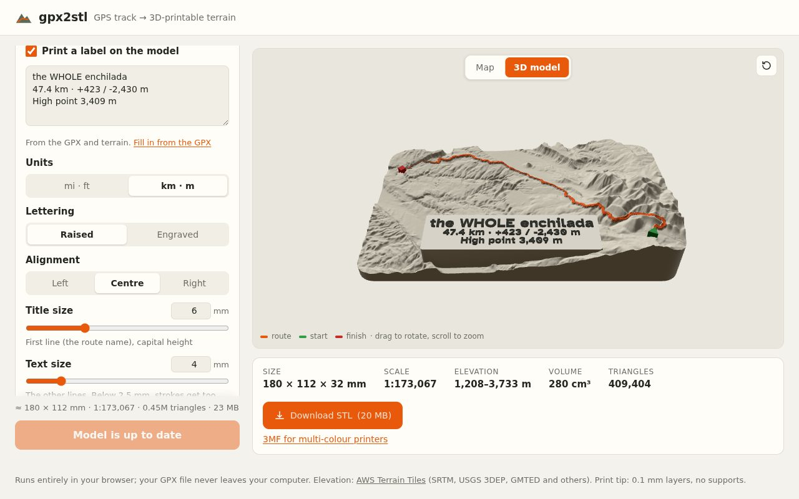

# gpx2stl

Turn a GPS track into a 3D-printable terrain model with your route on it.

**Use it here: <https://grabtharshammer.github.io/gpx2stl/>**. Nothing to install, and it works on
desktop and phone browsers. Everything runs in your browser; your GPX file is never uploaded anywhere.

## What it does

- Builds real terrain from public elevation data around your route, with the route raised,
  carved in, or printed as a **separate inlay** in another colour.
- Or a **quick flat print**: a thin plate with raised (or engraved) **contour lines**, or stacked
  **terraces**, one step per contour level. A fraction of the print time and material, and with
  raised lines you get two- or three-colour prints on any printer by changing filament at the
  heights the app gives you.
- **Print area on a topo map**: fit the route, or pick square, hexagon, circle or a custom box, and
  drag/resize it on the map.
- **Trim** the start and end of the track.
- **Start and finish markers** in a choice of shapes, turned to face the direction of travel.
- A **label plate** with your own text, prefilled with the route name, distance, climb, high point,
  and the date and duration when the GPX has real timestamps. Raised or engraved, any angle.
- Downloads: **STL** for single-colour printing, a **zip of parts** for printing the inlay
  separately, and a **3MF** with every colour as its own part for AMS/MMU printers.

## How to use it

1. **Load a route.** Drop a `.gpx` file on the page (from Strava, Garmin, Komoot, Trailforks, …)
   or try the Whole Enchilada example. Tracks, routes and multi-segment files all work; GPX
   elevations are ignored, since the terrain data is more consistent.
2. **Trim it** if you like: the *Start at* / *Finish at* sliders, or drag the green and red dots
   along the route on the map.
3. **Choose the print area** on the **Map** tab. *Fit route* takes the route plus the
   *Terrain around route* margin; *Square*, *Hexagon* and *Circle* keep their shape; dragging a corner
   in *Fit route* switches to *Custom*. The label under the map shows the area in km and the print
   size in mm, and warns if part of the route falls outside.
4. **Set up the model**: size, vertical exaggeration, detail, trail style, markers and label
   (see [Settings](#settings)). The line above the button estimates size, scale, triangle count
   and file size before you build.
5. **Generate model.** The first build downloads elevation tiles (cached for next time). The
   **3D model** tab shows the result: drag to rotate, scroll to zoom. Change anything afterwards and
   the button becomes **Update model**.
6. **Download** (see [Downloads and printing](#downloads-and-printing)).

Your settings are remembered in this browser; the route, trim and label text are not.

The address bar always holds your current settings (only the ones you've changed, e.g.
`?size=150&shape=hex&printStyle=contours`), so you can bookmark it or share it; **Copy link** in
the top bar copies it. Opening such a link uses its settings instead of the saved ones. The GPX
file, trim, label text and any area you drew on the map aren't in the link.

## Settings

| Setting | Default | Meaning |
|---|---|---|
| **Route** | | |
| Start at / Finish at | whole route | Trim the track; or drag the green/red dots on the map |
| **Print area** | | |
| Shape | Fit route | Fit route, Square, Hexagon, Circle or Custom. Drag the shape (or its centre handle) to move it, its corners to resize. Hexagon and Circle wrap themselves round the route; Hexagon picks flat- or pointy-top, whichever is smaller |
| Terrain around route | 1.8 km | Margin around the track; changing it resets an area edited on the map |
| **Model** | | |
| Print style | Relief | *Relief* (the terrain in 3D), *Contours* (lines on a flat plate) or *Terraced* (one step per contour level) |
| Size | 180 mm | Longest side of the print |
| Vertical exaggeration | 2× | Makes hills taller than real life |
| Detail | Standard | Draft (0.5 mm grid), Standard (0.3 mm), Fine (0.2 mm). Finer means bigger files |
| Units | mi · ft in the US, else km · m | For contour intervals and the label's stats |
| Contour lines | Raised | Contours style: raised lines (best after slicing, and colourable by a filament change) or engraved |
| Contour interval | Auto | Auto picks the finest round interval (in your units) whose lines stay at least 1.2 mm apart, so they don't merge when sliced; every 5th line is a bolder index line, and minor lines are dropped where the ground is too steep |
| Plate thickness | 2.4 mm | Flat styles |
| Line height / step height | 0.6 mm / 0.4 mm | Contours / Terraced |
| Line width | 0.5 mm | Contours; index lines are 1.5× wider. Go down to about your nozzle size |
| **Trail** | | |
| Style | Raised | *Raised* ridge, carved *Groove*, or separate *Inlay* (below) |
| Height / depth, width | 1.0 mm, 1.6 mm | For an inlay, height is how far it stands proud of the terrain; 2 mm width is sturdier |
| Inlay clearance | 0.15 mm | Gap per side between inlay and slot. Use *Download a test-fit piece* to check it on your printer |
| Inlay slot depth | 3 mm | How far the inlay sinks into the terrain, at least |
| Inlay tallest piece | 10 mm | The route is split into pieces only where one would get taller than this |
| **Start & finish** | | |
| Start / finish marker | Triangle / Square | None, Triangle, Circle, Square, Star or Hexagon; the triangle points the way you rode |
| Marker size, height | 6 mm, 2 mm | Height is above the highest ground under the marker |
| **Label** | off | |
| Text | from the GPX | Edit freely; *Fill in from the GPX* restores the stats. Follows trimming and the units until you type |
| Units | mi · ft in the US, else km · m | For the prefilled stats |
| Lettering | Raised | Or engraved into the plate |
| Alignment | Centre | Left, centre or right |
| Title size, text size | 6 mm, 4 mm | Capital-letter height of the first line and of the rest; at least 2.5 mm so strokes stay printable. Text too big for the print is scaled down to fit, with a note |
| Lettering depth | 0.8 mm | How far letters stand up, or are cut in |
| Rotation | 0° | Or drag the rotate handle above the label on the map (snaps to 15° steps when close) |
| Placement | automatic | Low and central, clear of the route; drag it on the map. The map warns if it covers the route or hangs off the print |
| **Advanced** | | |
| Base thickness | 3 mm | Under the lowest point (raised automatically to fit an inlay's slot) |
| Corner radius | 10 mm | 0 for square corners; also rounds the hexagon |
| Terrain smoothing | 0.8 | Softens noisy elevation data |

## Downloads and printing

- **Download STL**: the whole model as one body, for single-colour printing.
- **Flat prints in colour on any printer**: with raised contours, the stats list *Change filament at*
  heights (plate top, then line tops). Add a filament change at those layers in the slicer (Bambu
  Studio / OrcaSlicer: right-click the layer slider) to get a coloured map and a third colour for the
  route. Pick a layer height that divides them (0.2 mm works for the defaults).
- **Download parts (.zip)** (inlay style): `terrain.stl` plus `inlay-1-of-N.stl`, … numbered from
  start to finish. The inlay pieces are already turned to lie on their flat, sloped bottoms, so
  they print without supports. Print the terrain in one colour and the pieces in another, then press
  each piece into its slot (a drop of glue if the fit is loose). Print the test-fit piece first to
  tune *Clearance*.
- **3MF for multi-colour printers** (shown with an inlay or a label): one object whose parts are
  the terrain, route pieces, start and finish markers, and label lettering, in their assembled
  positions and without overlaps. In the slicer, assign a filament to each part.
  Bambu Studio says *"The 3mf file has invalid config, load geometry data only"* for any 3MF it
  didn't save itself; that's expected ([BambuStudio#11927](https://github.com/bambulab/BambuStudio/issues/11927)),
  and the model loads fine.

Print tips (OrcaSlicer / Bambu Studio): 0.08–0.12 mm layers, "Ensure vertical shell thickness:
All", ~1 mm top shell, 3 walls, 10–15% gyroid, no supports. Rounded corners and a mouse-ear brim
help against lifting.

## Limits

- One model can use up to 400 elevation tiles; for very large areas pick a coarser *Detail* or a
  smaller area. The estimate line warns before you build.
- Elevation detail is limited by the source data: roughly 10–30 m in the US, coarser in some
  other places (AWS Terrain Tiles). *Fine* only helps where the print is small enough to show it.
- Out-and-back sections and self-crossings merge into one ridge.
- A label placed over the route covers it (and with an inlay, the slot cuts through the label);
  the map warns about this.
- Without WebGL, the 3D preview is unavailable but building and downloading still work.

## Development

The app is a static site in `web/` with no build step: plain ES modules, with three.js, Leaflet,
opentype.js and manifold-3d (WASM) loaded from jsDelivr at pinned versions. Serve it over
`http://localhost` (module workers don't run from `file://`):

    cd web
    python -m http.server 8000

then open <http://localhost:8000>. Every push to `main` that touches `web/` deploys it to GitHub
Pages (`.github/workflows/pages.yml`); any static HTTPS host works (the tile cache needs a secure
context).

    web/
      index.html, css/   page and styles
      js/app.js          UI state, print area, label, trimming, downloads, three.js preview
      js/mapview.js      Leaflet map: route, trim dots, print footprint, label placement
      js/worker.js       runs builds, elevation profiles and test-fit pieces in a Web Worker
      js/core/           engine: GPX parsing, tile/PNG decoding, filters, footprints, markers,
                         label text, elevation profile, inlay pieces, model builder,
                         STL / ZIP / 3MF writers
      fonts/             Atkinson Hyperlegible Bold (OFL)
      examples/          sample GPX
    tests/               regression + headless-browser tests
    docs/                README screenshots

### Tests

Node 20+ and a Chromium install:

    cd tests
    npm install
    node regression.mjs [tile_cache_dir]       # engine checks
    node urlstate.mjs                          # settings <-> URL rules
    node browser.mjs /path/to/chromium [dir]   # full UI flow, screenshots to [dir]
    BASE_URL=https://grabtharshammer.github.io/gpx2stl/ node browser.mjs /path/to/chromium   # test the live site

`regression.mjs` checks that the default model still matches the reference model exactly, plus
hexagon cuts, markers, trimming, labels and the elevation profile, inlay fit (no overlap with the
terrain, pieces lie flat), and that the 3MF parts don't overlap and add up to the model. Tiles
are read from the cache directory or downloaded. `browser.mjs` drives the whole UI at desktop and
phone sizes, including every download.

## Credits

Elevation: [AWS Terrain Tiles](https://registry.opendata.aws/terrain-tiles/) (SRTM, USGS 3DEP,
GMTED and others). Map: [OpenTopoMap](https://opentopomap.org) (© OpenStreetMap contributors, SRTM)
via [Leaflet](https://leafletjs.com). Geometry: [manifold-3d](https://github.com/elalish/manifold).
Preview: [three.js](https://threejs.org). Label font:
[Atkinson Hyperlegible](https://www.brailleinstitute.org/freefont/) Bold (SIL OFL, `web/fonts/OFL.txt`),
read with [opentype.js](https://opentype.js.org).
